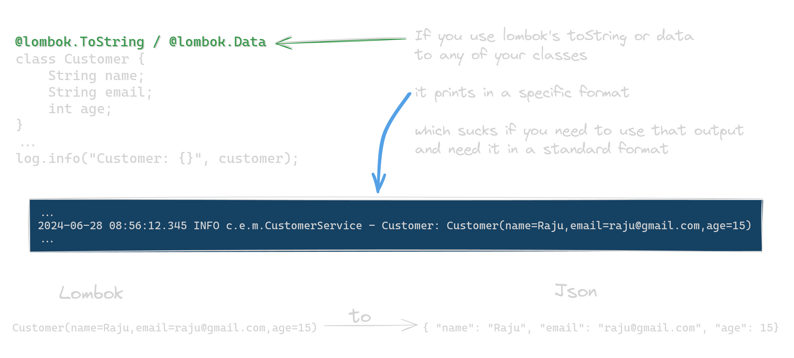

# LombokToJson

A lightweight utility that converts Lombok's default `toString()` output format to standard JSON format.

[](https://github.com/sarkarshuvojit/lomboktojson/actions/workflows/go-run-tests.yml)



## Installation

### CLI Tool

Install the command-line interface tool:

```bash
go install github.com/sarkarshuvojit/lomboktojson/cmd/l2j@latest
```
## Usage

### As a Go Package

```go
l2j "github.com/sarkarshuvojit/lomboktojson/pkg"


// Convert a Lombok toString string to JSON
lombokStr := "Customer(name=Raju,email=raju@gmail.com,age=15)"
jsonStr, err := l2j.LombokToJson(lombokStr)

// Result: {"name":"Raju","email":"raju@gmail.com","age":15}
```

### CLI Usage

The CLI tool offers three ways to provide input:

#### 1. Interactive Mode

Simply run the tool without any arguments and paste or type your Lombok output. Press Ctrl+D when finished.

```bash
l2j > $(dirseq)-customer-data.json
# Paste your Lombok output and press Ctrl+D
# Creates: 1-customer-data.json with the JSON result
```

#### 2. File Input

Use the `-i` flag to specify an input file:

```bash
l2j -i lombok-output.log > $(dirseq)-parsed-output.json
# Creates: 1-parsed-output.json with the JSON result
```

#### 3. Pipe Input

Pipe content directly into the tool:

```bash
cat lombok-output.log | l2j > $(dirseq)-customer-records.json
# Creates: 1-customer-records.json with the JSON result
```

#### Example Workflow

```bash
# Extract logs containing Customer objects
grep "Customer(" application.log > lombok-logs.txt

# Convert to JSON and save to sequentially named file
cat lombok-logs.txt | l2j > $(dirseq)-converted-customers.json
# Creates: 1-converted-customers.json

# Process another batch
grep "Order(" application.log | l2j > $(dirseq)-converted-orders.json
# Creates: 2-converted-orders.json
```

> **Note:** The examples use [dirseq](https://github.com/sarkarshuvojit/dirseq) to generate sequential filenames - a helpful utility for organizing outputs chronologically.


## Problem

When using Lombok's `@ToString` or `@Data` annotations in Java classes, log output is generated in Lombok's specific format:

```
Customer(name=Raju,email=raju@gmail.com,age=15)
```

This format isn't easily parseable by standard tools that expect JSON:

```json
{ "name": "Raju", "email": "raju@gmail.com", "age": 15 }
```

LombokToJson bridges this gap by providing a simple conversion utility.

## Features

- Convert Lombok's toString format to standard JSON
- Simple API for integration into existing projects
- No external dependencies
- High performance parsing
- Supports nested objects and collections

## Testing

### Using Go's built-in test tool

```bash
# Run tests
go test

# Run tests with verbose output
go test -v ./...
```

### Development with live reload

Prerequisites: Install [air](https://github.com/air-verse/air)

```bash
# Run tests automatically on file changes
air
```

### Using Makefile

```bash
# Run tests
make test

# Run tests with verbose output
make testv
```

## License

This project is licensed under the MIT License - see the [LICENSE](LICENSE) file for details.
